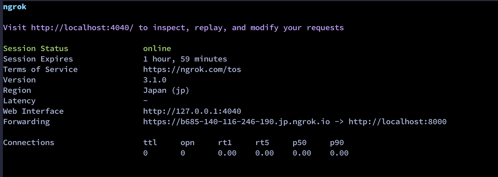
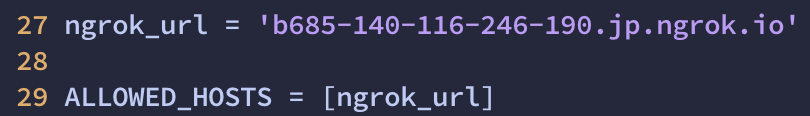
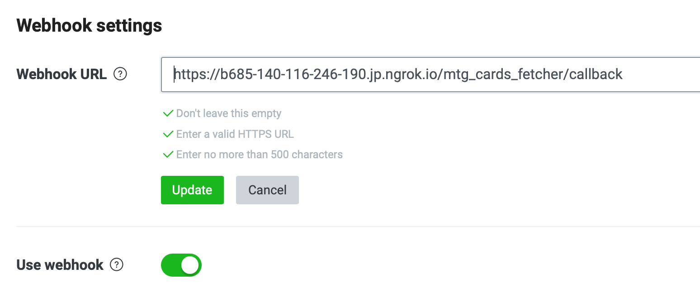

# MTG Cards Fetcher

power by Scryfall Api: [Scrython](https://github.com/NandaScott/Scrython)

## How to use

### Python Packages Requirement

Before deploy this bot, there is some python package need to install:
 - scrython
 - trasitions
 - requests
 - beautifulsoup4
 - line-bot-sdk
 - django

```sh
pip3 install scrython transitions requests beautifulsoup4 line-bot-sdk django
```

### Ngrok

And you may need install Ngrok to deploy this bot. 

#### Ubuntu

```sh
sudo apt install ngrok
```

#### macOS (with brew)

```sh
brew install ngrok
```

After installing Ngrok, you need to regist a Ngrok account, here is a [guide for Ngrok register](https://ngrok.com/docs/getting-started).

...or you can deploy with Google Could Platform, Amazon Web Services or Heroku.


### Start Up

First, you should start ngrok up and get an proxy url from that page.

```sh
ngrok http 8000
```



> That url at `Forwarding` is the proxy url (`https://b685-140-116-246-190.jp.ngrok.io` in this case), you will get diffrent url when you start Ngrok up next time.

Then update `ALLOWED_HOSTS` at `mylinebot/settings.py` and webhook settings at Line Developers website.



After these prepare, start django server up.
```sh
python3 manage.py runserver
```
